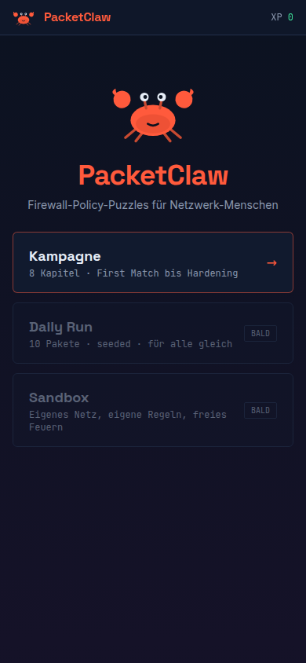
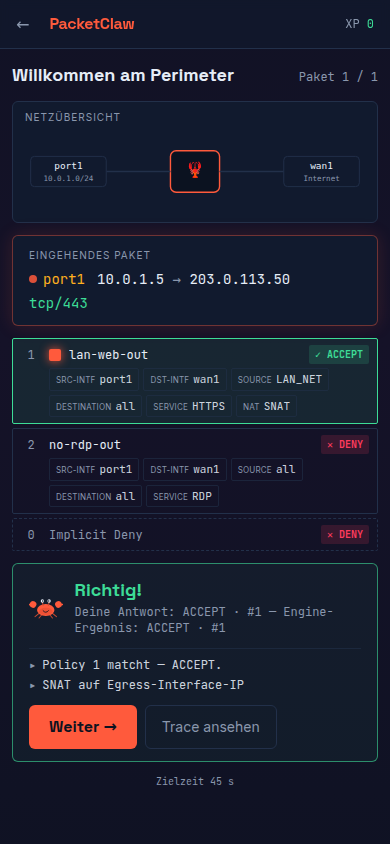
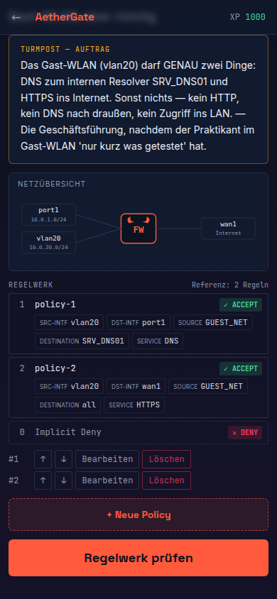
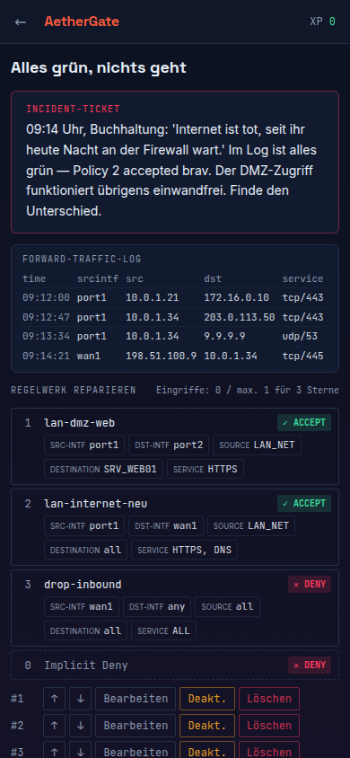

# 🦞 AetherGate

**Firewall-Policy-Puzzle-Game.** Trainiere First-Match-Logik, Regelreihenfolge, Adress-/Service-Objekte, Zonen, SNAT und VIPs/DNAT — als Spiel, im Browser, offline-fähig, installierbar als PWA.

Du bist **Torwächter des Venennetzes** im Turm von Aethermoor (der Welt von [QuestHall](https://github.com/B4lmoncl/QuestHall)): Entscheide, welcher Aetherstrom die Tore passieren darf. An deiner Seite: **Snipp, der Torwächter-Krebs**. Die Fachlichkeit darunter ist echt — Policies, Zonen, NAT, Implicit Deny.

> **Disclaimer:** Unabhängiges Lernprojekt, inspiriert von Konzepten stateful arbeitender Firewalls (u. a. FortiOS). Nicht mit Fortinet affiliiert. Keine Fortinet-Logos, -Marken oder GUI-Nachbauten.
>
> _Technische IDs (Repo, Paketname, Savegame-Key) tragen noch den Arbeitstitel `packetclaw`._

|  |  |  |  |
| :------------------------: | :-------------------------------------------------------: | :----------------------------------: | :--------------------------------: |
|            Home            |                 Packet Descent + Debrief                  |              Architect               |            Incident-Log            |

## Features

- **Deterministische Policy-Engine** (pure TypeScript, 96 %+ Branch-Coverage, Property-Tests): First Match top-down, Implicit Deny, Zonen, rekursive Objekt-Gruppen, Longest-Prefix-Routing, SNAT-Flag, VIP/DNAT mit den klassischen Fallen (`dstaddr all` matcht kein DNAT; Policy gehört aufs VIP-Objekt). Semantik + bewusste Vereinfachungen: [docs/ENGINE.md](docs/ENGINE.md)
- **Packet Descent** — die Signatur: Jedes Paket fährt die Policy-Tabelle sichtbar von oben nach unten ab, an jeder Regel glimmt das Feld auf, an dem sie scheitert, bis die matchende Zeile einrastet. Das Debrief nach jeder Antwort ist derselbe Engine-Trace in Textform — nie handgeschrieben. Unter `prefers-reduced-motion`: statische Trace-Ansicht.
- **4 Modi:** **Verdict** (ACCEPT/DENY + Policy-ID, touch-first, Timer ab Kapitel 3) · **Architect** (Tickets bauen gegen unsichtbare must-pass/must-block-Suite) · **Audit** (Shadowing finden, Reihenfolge fixen, Any-Any härten, Redundanz löschen — verifiziert durch Analysefunktionen) · **Incident** (Forward-Traffic-Log lesen, Root Cause fixen)
- **Kampagne:** 80 handgefertigte, CI-validierte Level über 8 Kapitel (First Match → Adressen → Services → Zonen → Stateful → SNAT → VIP/DNAT → Audit & Hardening), Schwierigkeitskurve mit Distraktoren, Boss-Level
- **Daily Run:** 10 seeded Aufgaben pro Tag (gleich für alle), Historie + Bestwert lokal, Share-Text ins Clipboard
- **Sandbox:** Regelwerk frei bauen, Testpakete abfeuern, Trace ansehen, Netz als JSON exportieren/importieren
- **Gamification:** XP mit Combo-Multiplikator, 3-Sterne-Kriterien pro Modus, 10 Ränge (Packet Rookie → Claw Commander), 26 Achievements mit Rarity-Stufen, Daily-Streak mit Freeze-Token
- **Accounts & Sync (optional):** Name + Passwort, Spielstand liegt auf dem eigenen Server (JSON im Docker-Volume, scrypt-gehashte Passwörter) und synct automatisch — ohne Konto bleibt alles lokal im Browser
- **PWA:** installierbar, komplett offline spielbar (alle Assets inkl. Fonts precached), kein Tracking, keine Drittanbieter-Requests
- **A11y:** durchgängige Tastaturbedienung, sichtbarer Fokus, Farbinformation nie alleinstehend, AA-Kontraste
- **i18n:** Deutsch (Default) + Englisch

## Deploy (VPS, ohne DNS — wie QuestHall)

Einmalig als root (baut direkt aus dem Repo, kein Registry-Login nötig):

```bash
cd /opt && git clone https://github.com/B4lmoncl/PacketClaw.git aethergate
cd /opt/aethergate
printf 'AETHERGATE_BIND=0.0.0.0\nAETHERGATE_PORT=8090\n' > .env
docker compose up -d --build
docker compose ps   # healthy?
```

Danach läuft das Spiel auf `http://<VPS-IP>:8090`. Accounts + Spielstände liegen im
Docker-Volume `aethergate-data` und überleben Rebuilds. Update:
`cd /opt/aethergate && git pull && docker compose up -d --build`.

Hinter Reverse Proxy (TLS): `.env` weglassen — Default ist `127.0.0.1:8090`.
Details, Backup und Traefik/nginx-Beispiele: [docs/DEPLOY.md](docs/DEPLOY.md)

> Ohne HTTPS registriert der Browser keinen Service Worker — PWA-Install/Offline
> gibt es dann nicht, das Spiel selbst läuft aber vollständig.

## Entwicklung

```bash
npm ci
npm run dev              # Dev-Server
npm test                 # Engine-/Game-Tests (vitest, inkl. fast-check-Property-Tests)
npm run test:coverage    # mit Coverage-Gate (>95 % Branch auf src/engine/)
npm run validate:levels  # alle Level pruefen (laeuft auch in CI)
npm run lint             # ESLint + Prettier
npm run build            # Typecheck + Produktions-Build + PWA
```

Architektur, Entscheidungen und Phasenstand: [PLAN.md](PLAN.md) · Level-Format: [docs/CONTENT.md](docs/CONTENT.md) · bewusst weggelassen: [REJECTED.md](REJECTED.md) · später: [ROADMAP.md](ROADMAP.md)

## Lizenz

[MIT](LICENSE)
